# HYDRO-WHIPLASH-RESEARCH-SUMMARY
A summary of my study on hydrological whiplashes.
Whiplash, a newly coined term by climate scientist to refer to the quick transition from one extreme to the other. This project focuses on hydrological whiplash, which in this case we are looking at quick Dry-to-Wet or Wet-to-Dry event. We learn from the method of the paper: [Increasing global precipitation whiplash due to anthropogenic greenhouse gas emissions(Tan et al., 2023)](https://doi.org/10.1038/s41467-023-38510-9)

The document aims to summarize how whiplash is calculated based on Tan's framework, and some revision that we propose for further study. 
We will walk through the following sections:
**Core idea, Tan's framework, An idealized model, Data analysis & results** .


## Core idea and setting of this hydrological whiplash analysis

- Structure of whiplash. A whiplash includes
  - Extremes on both sides. Eg: dry and wet
  - Fast transition. In practice, we set a maximum days between one extreme to the other.
    
  In the study of whiplash, we are looking at the fast transition from one extreme to the opposite extreme; hence before studying whiplash, we should define what extreme is and set a suitable timescale of whiplash. In our study, we define extreme from a climatological perspective and the timescale of extremes and whiplash are subseasonal. This section will discuss about the details.


- Motivation of moving sum on daily precipitation:

  Roughly speaking by a water resource perspective, a few days of dry or precipitation doesn't cause severe issue to the reservoir water levels, while one or a few months of dry condition can result in serious problems in water resources and thus affect our daily lives.

  Also, if looking at the daily precipitation of an area, for example at the subtropical regions,we may notice that there are a lot of zero precipitations. This characteristic makes it hard to conduct statitical analysis on a daily basis. By first cumulating 30 days of precipitation centered at each day, we can remove this zero-padded data issue.

- From a climatology perspective

  One thing to know about this analysis is that we are comparing precipitation data to the historicals (details to be discussed later in Tan's framework). Thus,a dry spell or drought can be identified as a dry extreme in this anaylsis, which is intuitive; however note that a relative smaller cumulative precipitations in wet season can also be an extreme dry event. Same logic applies to extreme wet.
  
  Now consider a scenario when in the transition seasons from climatological dry season to climatological wet season, a consecutive days of rainy days in dry season followed by a relative smaller precipitation in wet seasons could be identifies as a Wet-to-Dry whiplash event although it the climatological transition is opposite.

  The above scenario may seem counterintuitive and illogical, but in a climatology point, it is assumed that we are used to the expected climate(precipitation) given the time of a year. This example of Wet-to-Dry scenario tells us that the water supply is higher but later lower than usual for the reserviors of that area, supposing other factors remain the same. Therefore, studying whiplash and its future trend in this climatology manner can be informative to those who are managing water resources.

---
---

## Tan's framework

For a grid on the global map, we have the following four steps to identify the whiplah event on that grid. Abbbreviate precipitation as pr.

### Steps of Tan's method
**1. Linearly detrend daily pr by annual sum, then calculate moving sum of detrended pr within 30 days**

* Sum up the daily pr into annual pr, then fit a linear relationship y = ax + b, where y = annual pr  and x = year. For example, we use the pr data from 1979 to 2019, so we have 41 years of annual pr (y) that corresponds to each year (x).

* The detrended daily pr is the original pr subtracted by the annualy trended pr. For example at 2000 Jan 1st, the detrended pr is the pr at 2000 Jan. 1st minus the annual pr of 2001.

* For each daily pr, caluclate the 30-days ( 15 days before and 15 days after ) cumulative detrended pr, denoted as $$P_{i,j}$$, where i, j represent the i-th year and j-th julian day, respectively.


**2. Calculate Standardized annual-cycle-removed cumulative pr anomalies $$P_{i,j}' = \frac{P_{i,j} - \overline{P_j}}{\sigma_j}$$, where $$\overline{P_j}$$ and $$\sigma_j$$ is the mean and standard deviation of j-th julian day over the period.**

For example, $P_{2001,1}' = \frac{P_{2001,1} - \overline{P_1}}{\sigma_1}$, where $\overline{P_1} = \sum\limits_{i = 1979}^{2019} P_{i, 1}$ and $\sigma_1 = \sqrt{\sum\limits_{i = 1979}^{2019} (P_{i, 1} - \overline{P_1})^2}$


**3. Identify wet and dry extremes**
- Let $q_{upper}, q_{lower}$ be the threshold quantiles for wet and dry extremes respectively.Two different methods of defining extremes are discussed here:
  - Thresholds based on the whole period:

    This is the method proposed in Tan's paper. They aggregate the $P_{i, j}'$ for all $i, j$, and then define those anomalies that are larger than $q_{upper}$ as wet events and those anomalies that are lower than $q_{lower}$ as dry events.

  - Thresholds based on each julian day:
    This is an alternative method. Instaed of identifying extremes for the whole period, we propose to consider the seasonal variability: For each julian day, define its own upper and lower thresholds, then extremes identifies are based on the historical of the julian day.


> **_NOTE:_** We believe that it would be more suitable to apply the second method than the first. Since the variation of pr can differ significantly between wet and dry season of that grid, identifying extremes based on the whole period anomailes could result in undesirable bias of extreme sampling.


> For example, consider a case that during the wet seasons, the $P_{i, j}'s$ are normally distributed with larger mean and during the dry seasons, the  $P_{i, j}'s$ are right-skewed as often there is no precipitation for consecutive days. If we identify extremes combining wet and dry seasons, as illustrated in Fig 1., then most wet(dry) extreme events identifies are in wet(dry) seasons. However, as mentioned earlier in **Core idea of this hydrological whiplash analysis**, what we wish to identify from a climatology perspective includes the relative wets in dry seasons and relative dries in wet seasons. Thus, we propose to identify extremes based on each day historicals to tackle this issue, as illustrated in Fig 2..
> 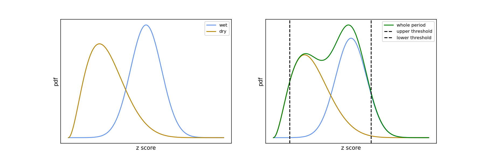   
> <p align="center"><em> Fig 1. Thresholds based on whole period </em></p>

> 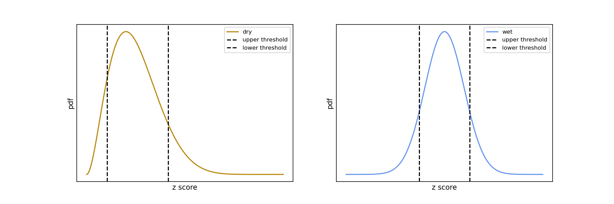 
>  <p align="center"><em> Fig 2. Thresholds considering seasonal variability </em></p>

要改圖 z score的圖應該要是zero mean的

- Merging mutiple wets(dries) into an independent wet(dry):
  - Notice that the memoryness of atmosphere and the charateristic of precipitation, for example in mid latitude regions where usually it rains for consecutive days, We will have to merge consective wets(dries) into a single event to avoid repetitive counting. Adoped from Tan's method, first we merge consecutive wets into a wet. For a merged wet event, say wet_1, if in the following 30 days from the last day of wet_1 exists another wet event, say wet_2, and the average $P_{i, j}'$ from first day of wet_1 until last day of wet_2 is larger than the upper threshold, then we further combine wet_2 into wet_1 and continue to check for the following 30 days iterately until there is no wet to be combined. The same logic applies for dry too.
 

**4. Identify whiplash, both Dry-to-Wet and Wet-to-Dry**
- In **Core idea of this hydrological whiplash analysis** we discuss the structure of whiplash, simply extremes and fast transition. Now after defining so-called independent extremes( both wet and dry), we may proceed to identify whiplash. Introduce a variable called inter_period, which in our whiplash identifiaction is the maximum days from the last day of one extreme to the first day of another extreme. In Tan's analysis, they set the inter_period to be 30 days.
- Example code and explanation for identifying Wet-to-Dry whiplash(same logic for Dry-to-Wet whiplash):
  ```python
  1 whiplash_wd = []
  2 for w_start, w_end in Indep_WET:
  3    for d_start, d_end in Indep_DRY:
  4        if 0 < (d_start - w_end) <= inter_period:
  5            if len(whiplash_wd) > 0 and whiplash_wd[-1][2:] == (d_start, d_end):                # avoid repetitive counting for same dry in Wet-to-Dry
  6                del whiplash_wd[-1]
  7
  8            whiplash_wd.append((w_start, w_end, d_start, d_end))
  9            break                                                                               # avoid repetitive counting for same wet in Wet-to-Dry
  ```

  > **_Explanation of the code:_** For each independent wet event, if there exists a dry event where its first day is within inter_period days from the last day of the wet event, then identify this pair of wet and dry as a Wet-to-Dry. Note that we require every wet and dry in each Wet-to-Dry event to be unique, so line 5 and line 9 were written to avoid repetitive counting issue.

### Reproduction of Tan's work with revision on defining extremes

- Data: **ERA5-land-only**

- Reproduction: See the comparison below
  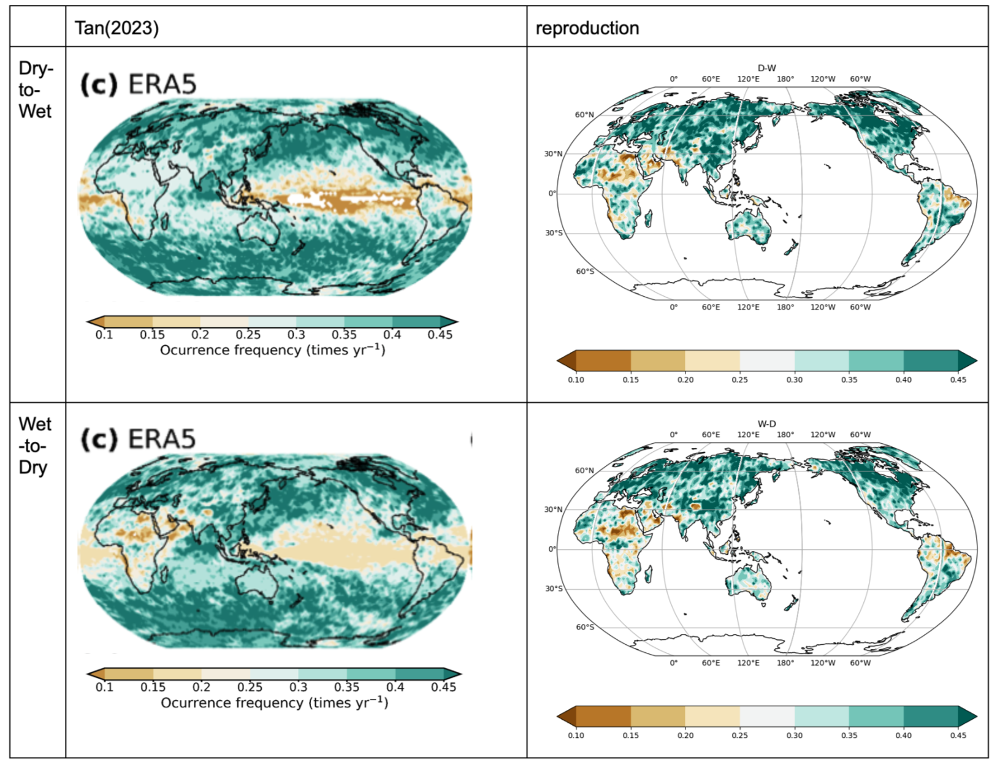
  > **_NOTE:_** The plots on the left column are screenshot from the fig 6 and fig 7 of supplmentary document of Tan's paper, see [Tan's supplementary doc](https://static-content.springer.com/esm/art%3A10.1038%2Fs41467-023-38510-9/MediaObjects/41467_2023_38510_MOESM1_ESM.pdf) .
  > The reproduction is quite successful in terms of global spatial patterns and scales of frequencies, except the north and middle east regions of the Dry-to-Wet whiplash.

- Revision: Different from Tan's method, we calculate thresholds based on each day historical anomalies instaed of the whole period anomalies. (See **Tan's framework - 3. Identify wet and dry extremes**)

- Results:

  - Frequency per year:

  <div>

  | Dry-to-Wet | Wet-to-Dry |
  | :---: | :---: | 
  |  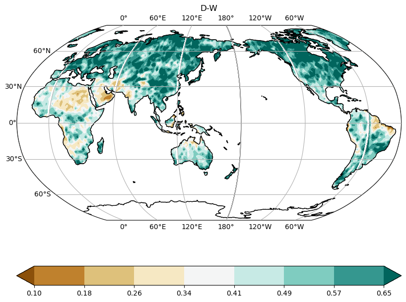 |  |
  
  <div>

  - Trend of frequency:
  
  <div>

  | Dry-to-Wet | Wet-to-Dry |
  | :---: | :---: | 
  |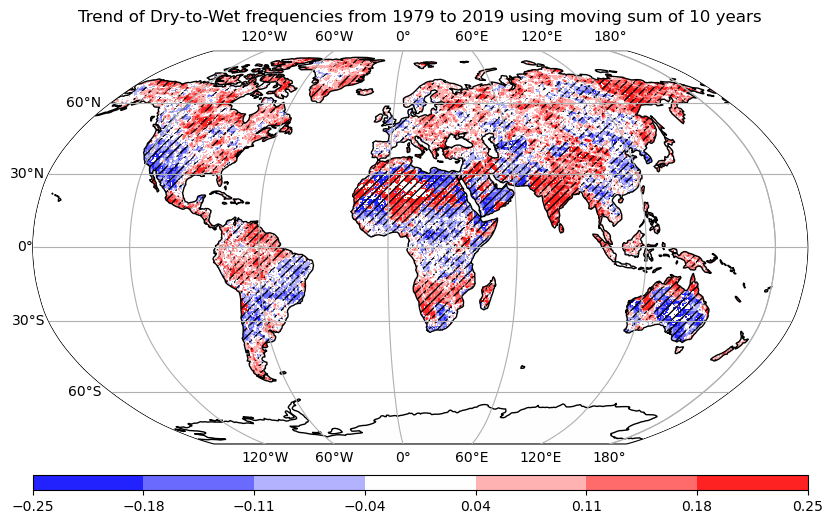 | 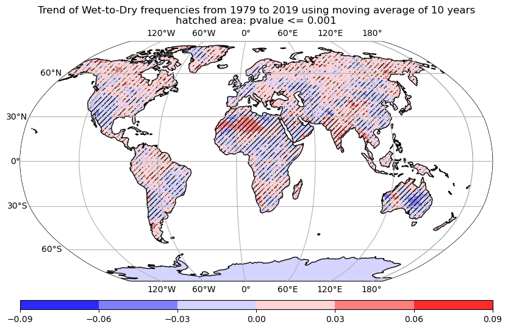 | 

  <div>
 
- annual precipitation trend vs. extremes trend vs. whiplash trend (TBU)

   這二組圖可以看annual pr trend 對extreme trend 貢獻、extreme trend對whiplash trend 貢獻


### Further studies
- More statistics of whiplash (future work. 在定義好whiplash的算法後再分析這些統計量)

  Besides frequencies, we can also study various characteristics of whiplash, including

  - Timing: defined as the starting season(month) of a whiplash.

  - Duration: defined as the duration from first day of first extreme to the last day of second extreme of a whiplash.

  - Transition: defined as the duration from the last day of first extreme to the first day of second extreme of a whiplash.

  - Whiplash Intensity(WI): defined as the difference between the wettest and driest of a whiplash.

  - Whiplash Intensity Slope (WIS): defined as WI divided by transition days. 
    
 


- Analysis on future projection
  - We may also make future projections on whiplash using models with available data. However, there is one thing to ponder. Recall that before identifying whiplash, we find extremes first. **But in future scenarios where distributions of precipitations are most likely to change, is it reasonable to recognize extremes based on the thresholds that are calculated from current climate?** Alternatively, is there an better method?

    To answer this question, we proposed an idealized model to investigate the relationship between number of extremes and frequency of whiplash. See next section.

---
---

## Simple idealized model
### Motivation

Now we study an idealized model to discuss the contributions of number of extremes on frequency of whiplash as well as the application of this idealized model. 
Recall that a whiplash includes both extremes and fast transition between extremes. An increase frequency in whiplash can be resulted from two factors: **1. Increase amounts of extremes 2. Extremes on both side getting closer.**

To quantify the contribution of the former factor, here we build an idealized model where proportions(amount) of extremes are given as one of the inputs. 

### Example code for counting Wet-to-Dry in the idealized model

  ```python
   1  import numpy as np
   2  p_wet, p_dry = 0.1, 0.1
   3  n_total = 1500
   4  n_wet = int( np.round(n_total*p_wet, 0))
   5  n_dry = int( np.round(n_total*p_dry, 0))
   6  n_non = n_total - n_wet - n_dry
   7  Nums = np.array([1]*n_wet + [-1]*n_dry + [0]*n_non)
   8
   9  np.random.shuffle(Nums)                             # randomly shuffle
  10
  11  wet_i = np.where(Nums == 1)[0]
  12  dry_i = np.where(Nums == -1)[0]
  13  inter_period = 5
  14
  15  WD = dict()         # wet: keys, dry: values
  16  for w in wet_i:
  17      for d in dry_i:
  18          if 0 < d - w <= inter_period:
  19              if d in list(WD.values()):              ## then we need to update new wet
  20                  w0 = list(WD)[-1]
  21                  del WD[w0]                          # to prevent repetetive couting wets
  22                  WD[w] = d
  23              else:                                   
  24                  WD[w] = d                           ## or directly stores whiplash
  25
  26              break                                   # to prevent repetetive couting dries
  27          if d-w > inter_period:
  28              break
  29 print('Wet-to-Dry frequency: ', len(WD) / n_total)
  ```
  > **_Explanation of the code:_** This model assumes there are in total 1500 days and the upper and lower thresholds are given as 90% and 10%, so p_wet, meaning the proportion of wet extremes, is 1 - 90% = 0.1; and p_dry is 0.1 . Thus, there are 1500*0.1 = 150 wets and dries each. Next, we generate a time series contain those wets and dries, indexed as 1 and -1, with the rest being normal days (indexed as 0). Then we shuffle it to make the time series random. Lastly we start to calculate the whiplash events with a given inter_period. Note that for Dry-to-Wet whiplash, the logic for identification is same.


### Results of the relationship of extreme proportions and inter_days on whiplash frequecy

We run this idealized model with different values of p_wet and p_dry. Currently we take the p_wet and p_dry to be identical, assuming both extremes increase or decrease toghether at the same direction and rate.

Since inter_period may also affect the counts of whiplash, for example shorter inter_period makes the whiplash frequency smaller, we also feed different values of inter_period into the model. For each p_wet, p_dry and inter_period, we run the model for 100 times and then average the 100 results to plot the following figure.


  <div>

  | | | 
  | --- | --- |
  | 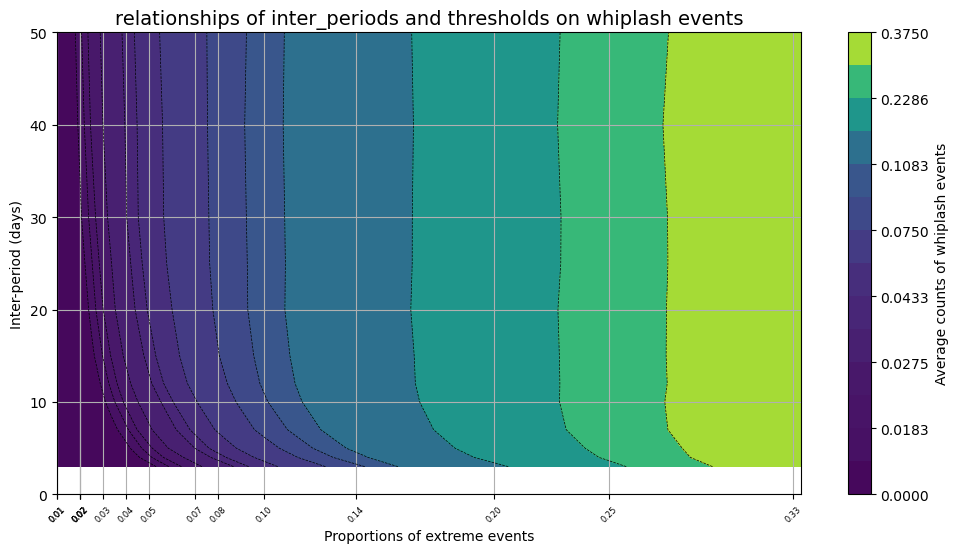 | 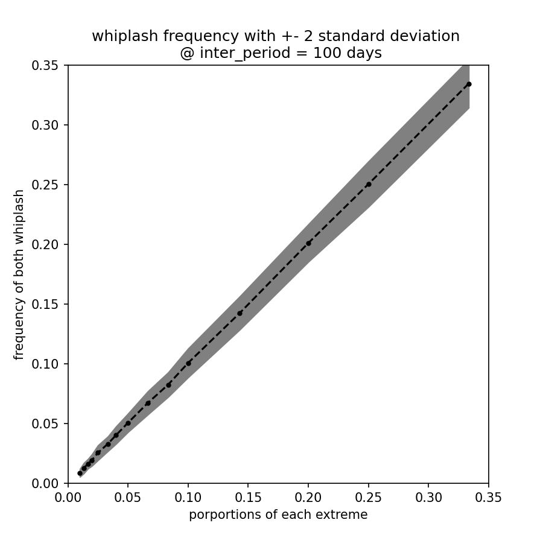|
  </div>


### Discussion
- Expected whiplash frequency is a function of inter_period. But when iner_period is longer than a certain days, which has a monotonic relationship to the inverse of p_wet/p_dry, whiplash frequency is unaffected by the choice of inter_period.
- As shown in the right figures above, when we are analyzing whiplash during a period with fixed thresholds, under the climate change trending, if there are +s% of extreme events on both sides, then there the total whiplash frequencies increase by s%.
- Note that in this ideal scenario, no information of seasonals is added, so this ideal model is consistent with Tan's method of identifying extremes, which considers the anomalies of whole period. Another thing to note that is under no seasonal variability, the other method that we proposed is nearly equivalent to Tan's method. See **Tan's framework - 3. Identify wet and dry extremes**. 
- This idealized model can also be used as a statistical test to check if extremes of both sides are significantly closer or is it the identified whiplash just a statistical result.

### Answering the question from the previous section

  可以畫圖證明用fixed thesholds所算出來的future whiplash可以被idealized model所預測。如此就會突顯使用moving threhsolds的重要性。(也就是移除extremes trend的貢獻)

  In our study, what we want to shed light on is the latter factor, that is extremes getting closer. A way to analyze is to make sure the amount of extremes to be the same over the periods of study. 

### Distinct proportions of extremes (possible future works)
- So far we set the proportions of wets and dries to identically increase or decrease when concieving future scenarios. What are the behaviors of whiplash when the trends of numbers of extremes are distinct? （在這個分析在當p_wet = p_dry 對分析結果的解釋性不高時可以考慮做做看以加強我們強調moving threshold的重要性）

##  Autoregressive Idealized Model
- When generating random time series, make it atuoregressive. So we can answer question such as under different levels of memory, what is the expected whiplash frequency? And for each grid, find a way to estimate its level of memory to compare with this model.

### AR(1) Model:
    
  $X_t = \phi X_{t-1} + \epsilon,\quad \epsilon \sim N(0,\quad 1 - \phi^2)$
  
  $X_0 \sim N(0,1)$

  >Note: $\phi$ is the lag 1 autocorrelation and is given between 0 to 1 to represent the strength of memory of the time series. 
  > - When $\phi = 0$, the model reduces to the imple idealized model above, which has no autocorrelation. 
  > - When $\phi$ is close to 1, one can imagine that the extremes are clustering, and hence a smaller amount of whiplash.

  >It is mathematically true that when $|\phi| < 1$, the time series is stationary. The variance of the noise $\epsilon$ is given as $1 - \phi^2$ such that  $X \sim N(0, 1)$.

### Example code for generating AR(1) model and extremes

```python
 1  n_total      = 1500
 2  phi          = 0.5         # lag 1 autocorrelation is 0.5, for example    
 3  sigma        = 1.0 * (1 - phi**2)**(1/2)    
 4  wet_q        = 0.9    
 5  dry_q        = 0.1    
 6  inter_period = 30    
 7
 8  np.random.seed(42)  
 9
10  X = np.zeros(n_total)
11
12  for t in range(1, n_total):             # AR time series generation
13      eps_t = np.random.normal(0, sigma)
14      X[t] = phi * X[t-1] + eps_t
15
16  u_wet = np.quantile(X, 1 - wet_q)
17  u_dry = np.quantile(X, dry_q)
18
19  Nums = np.zeros(n_total, dtype=int)
20  Nums[X >= u_wet] = 1    # wet
21  Nums[X <= u_dry] = -1   # dry
```
The code for identifying whiplash that follows is identical to the simple idealized model.
### Results: (TBU)
  <div>

  | | | |
  | --- | --- | --- |
  | 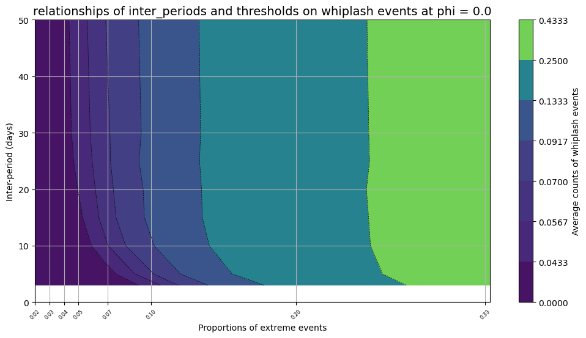 | 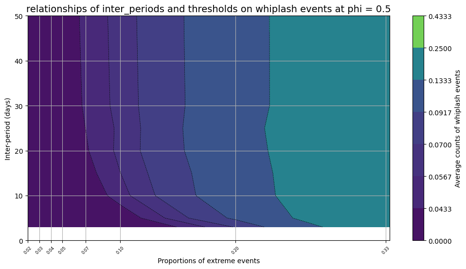| |
  </div>

### Discussions: (TBU)

---
---
  

## Data analysis of the 1pct CO2 increase per year models
- Data: **CanESM 151 years 1pct CO2 increase per year**
### Methods of fixed or moving:

  - **Method 1 (fixed thresholds)**:

    Set extreme thresholds based on the first 40 years and identify extremes and whiplash for the whole 151 years. This method is consistent to Tan's future scenario analysis.

  - **Method 2(moving thresholds)**: 

    Calculate whiplash with 40 years as a period and move 5 years one time. That is, this includes periods of 1850 ~ 1889, 1855 ~ 1894, 1860 ~ 1899, ... , 1960 ~ 1999. (in total 23 periods). This method tries to consider the climate change distributive changes of precipitations, so it calculates whiplash on a moving basis.

  >Note: Here, both methods have been revised to consider seasonal variability of thresholds. (See 3. Identify wet and dry extremes**)


### Results

  - Method 1:

    <div>

    | Globally Averaged Frequency Time Series | Dry-to-Wet Trend | Wet-to-Dry Trend |
    | --- | --- | --- |
    | 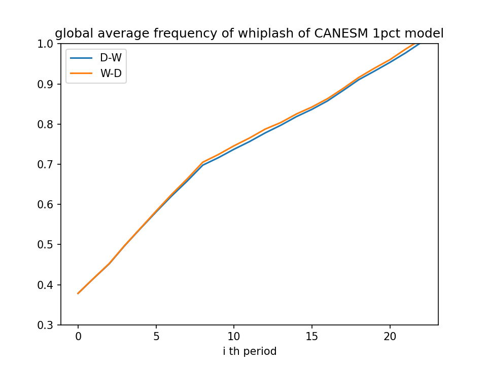 |  | 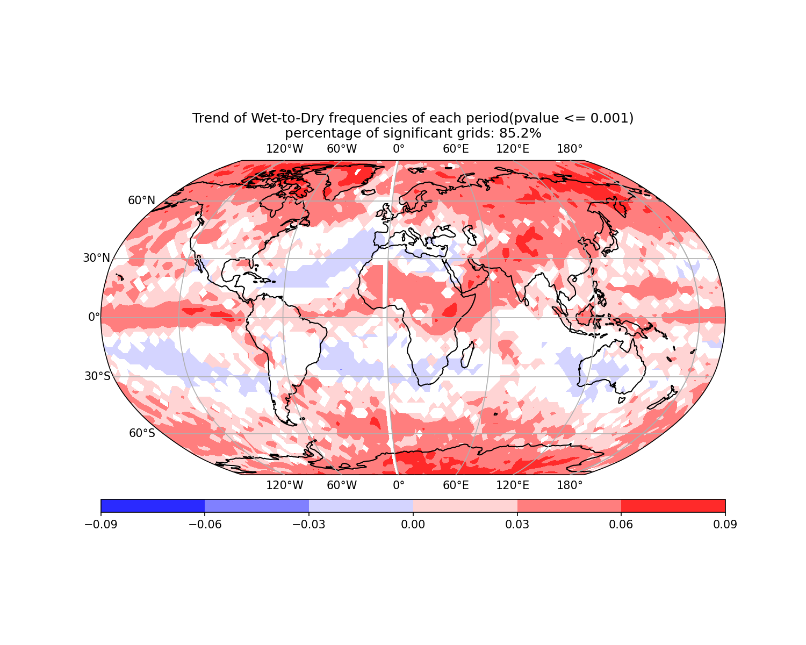 |

    </div>

  - Method 2:

    <div>

    | Globally Averaged Frequency Time Series | Dry-to-Wet Trend | Wet-to-Dry Trend |
    | --- | --- | --- |
    | 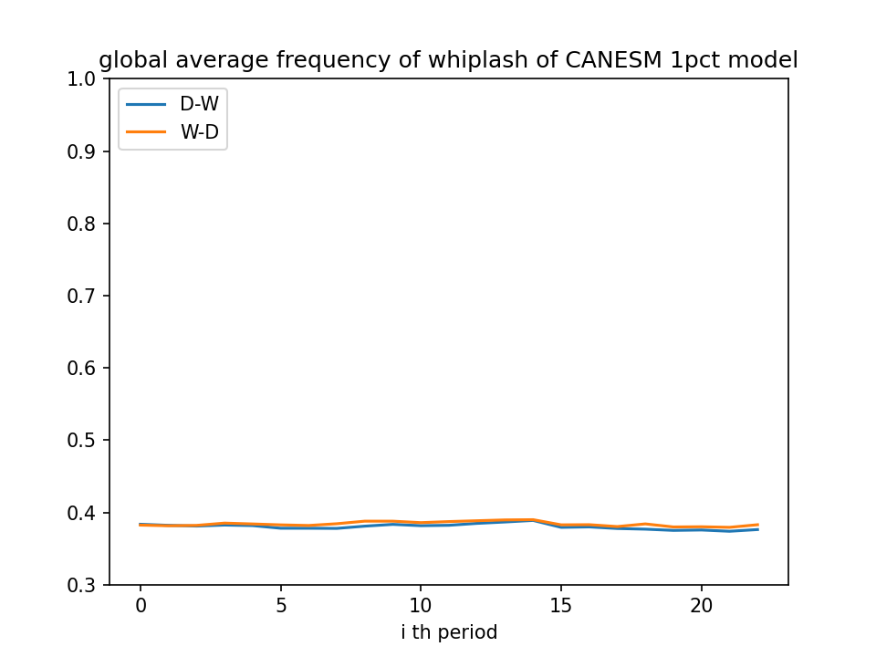 | 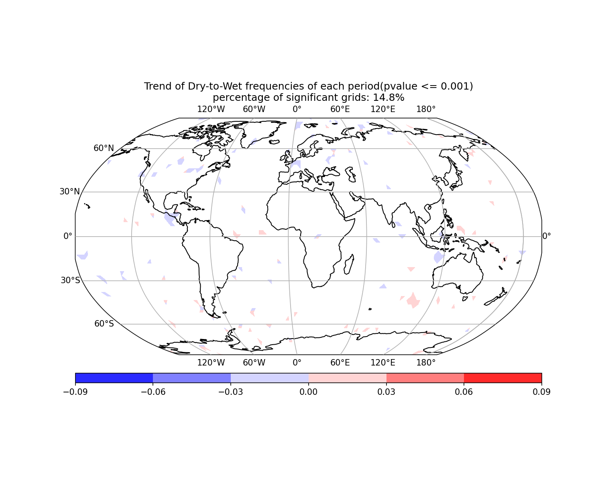 | 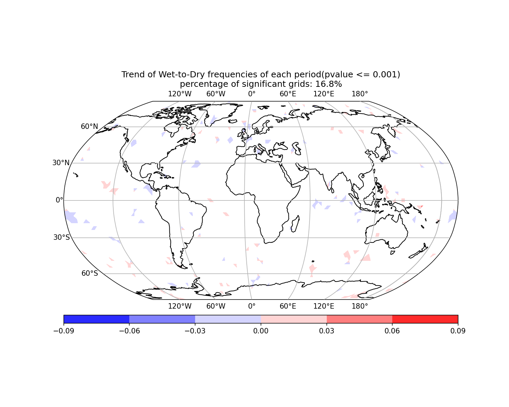 |

    </div>


### Discussions:
  - Strong trend in Method 1
  - No trend in Method 2
